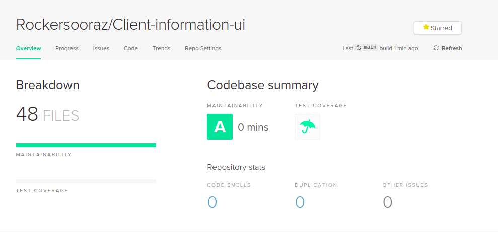

## Introduction

This is an SPA written in Typescript Angular framework.This app comprises the user interface for performing the CRUD operation of the clients with proper validation.
It comprises static login page.Just click on login button, and you will be redirected to the client-creation page.

## Features(Components)

1. Login 
2. Client-Creation with validation
3. Listing of client with pagination
4. Detail View of Clients
5. Deletion of clients
6. Update information of clients

## Use of Library and Purpose of use

1. bootstrap - To provide the quick styling
2. font-awesome  - To present with required icons


## Code Quality Checking

This Github repository has been scanned through codeclimate and following result was obtained.


## Installation

```bash
$ npm install
```

## Running the app

```bash
# development
$ npm run start
```

## Stay in touch

- Author - [Suraj Adhikari]()
- LinkedIn - [@surajadhikari](https://www.linkedin.com/in/surajadhikari98/)

